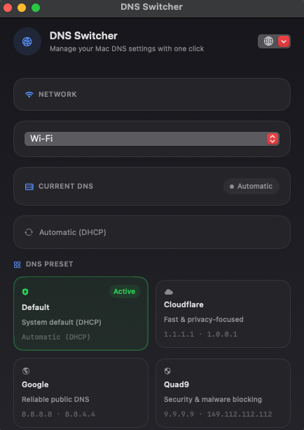

# DNS Switcher

A lightweight macOS app to switch DNS settings with one click. Built with SwiftUI, with full support for **English** and **Persian (فارسی)**.




## Download

Get the latest pre-built app from [GitHub Releases](https://github.com/TronIsHere/dns-switcher/releases/latest).

1. Download `DNS-Switcher-macOS.zip` from the latest release.
2. Unzip the archive.
3. Move **DNS Switcher.app** to your Applications folder (optional but recommended).
4. Open the app. **Blocked by macOS?** See [Can't open the app?](#cant-open-the-app) below.

> Changing DNS requires administrator privileges. macOS will ask for your password when you apply or reset DNS settings.

## Can't open the app?

> [!IMPORTANT]
> **Read this if macOS blocks DNS Switcher on first launch.** The app is not broken. Because it is downloaded outside the Mac App Store, macOS may refuse to open it until you do one of the steps below.

> [!WARNING]
> **"Cannot be opened"**, **"damaged"**, **"cannot be verified"**, or **"unidentified developer"** are normal for unsigned apps. Follow these steps in order:

**Step 1 — Restore the executable bit** (most common fix after unzip):

```bash
chmod +x "/Applications/DNS Switcher.app/Contents/MacOS/DNS Switcher"
```

**Step 2 — Remove the download quarantine flag:**

```bash
xattr -cr "/Applications/DNS Switcher.app"
```

**Step 3 — Open via right-click:**

Right-click **DNS Switcher.app** → **Open** → click **Open** again in the dialog.

**Step 4 — Allow in System Settings:**

If macOS still says the app **cannot be verified**, try step 3 once, then open **System Settings → Privacy & Security** and click **Open Anyway** next to the DNS Switcher message.

Then run:

```bash
open "/Applications/DNS Switcher.app"
```

> [!TIP]
> You only need to do this once. After the app opens successfully, macOS will remember it.

## Features

- One-click DNS presets: Default (DHCP), Cloudflare, Google, Quad9
- Custom primary and secondary DNS servers
- Saved profiles for quick reuse (Work, Home, Gaming, and more)
- Per-network interface selection (Wi-Fi, Ethernet, and others)
- Bilingual UI: English and Persian with RTL layout for Persian
- Shows your current active DNS and detects matching presets

## User guides

- [English user guide](docs/USER_GUIDE.en.md)
- [راهنمای فارسی](docs/USER_GUIDE.fa.md)

## Quick start

1. Launch DNS Switcher and complete the onboarding screen (choose your language).
2. Select your **network service** (for example Wi-Fi).
3. Pick a **DNS preset** or enter custom addresses.
4. Click **Apply DNS**.

To return to your router or ISP defaults, click **Reset to Automatic**.

## Build from source

Requirements: macOS 14 or later, Xcode Command Line Tools (`xcode-select --install`).

```bash
git clone https://github.com/TronIsHere/dns-switcher.git
cd dns-switcher
./build.sh
open "build/DNS Switcher.app"
```

To regenerate the app icon from `logo.png`:

```bash
./scripts/generate-icon.sh
```

## How it works

DNS Switcher uses the macOS `networksetup` command to read and update DNS servers for the selected network interface. Write operations run with administrator privileges via AppleScript.

## Releases

Tagged releases are built automatically on GitHub Actions. To publish a new release:

```bash
git tag v1.0.0
git push origin v1.0.0
```

The workflow builds the app, zips it, and attaches it to the GitHub release.

## License

MIT
